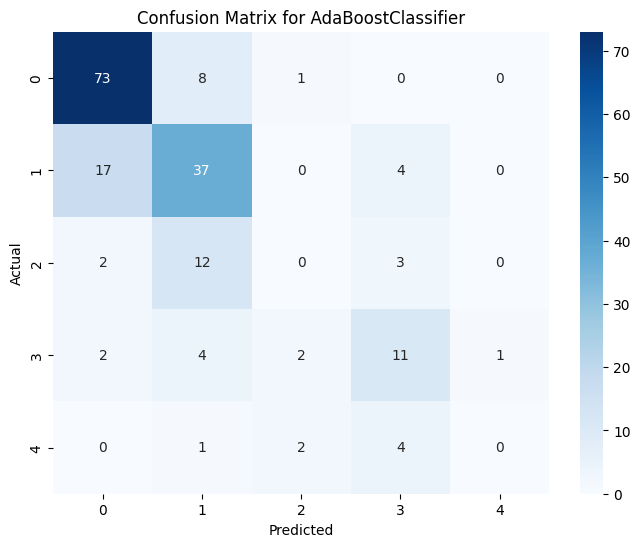
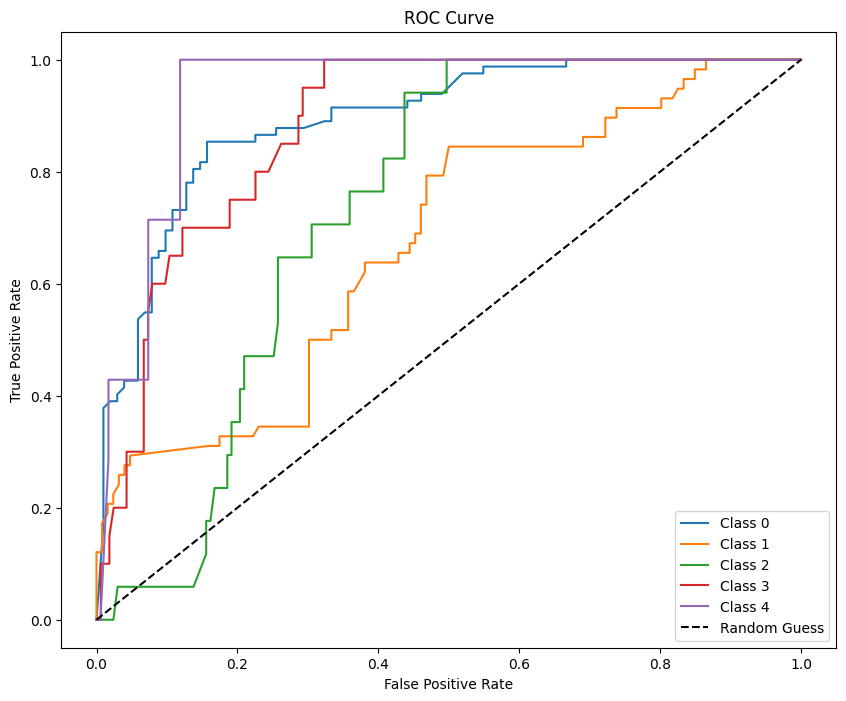

# **CardioPredict Machine Learning Approach**


This project aims to predict the presence and severity of heart disease in patients using machine learning. The dataset used is the **Heart Disease UCI** dataset, which contains various patient attributes such as age, sex, chest pain type, resting blood pressure, cholesterol levels, and more. The goal is to build a robust machine learning model that can accurately classify the severity of heart disease based on these features.

---

## **Table of Contents**

- [**CardioPredict Machine Learning Approach**](#cardiopredict-machine-learning-approach)
  - [**Table of Contents**](#table-of-contents)
  - [**Project Overview**](#project-overview)
  - [**Dataset**](#dataset)
    - [**Dataset Features:**](#dataset-features)
  - [**Project Structure**](#project-structure)
  - [**Installation**](#installation)
  - [**Usage**](#usage)
    - [**Training the Model**](#training-the-model)
    - [**Making Predictions**](#making-predictions)
  - [**Model Performance**](#model-performance)
    - [**Confusion Matrix**](#confusion-matrix)
    - [**ROC Curve**](#roc-curve)
  - [**Contributing**](#contributing)
  - [**Acknowledgements**](#acknowledgements)

---

## **Project Overview**

This project involves the following key steps:

1. **Exploratory Data Analysis (EDA)**: Understanding the dataset, handling missing values, and identifying patterns and correlations.
2. **Data Preprocessing**: Cleaning the data, encoding categorical variables, and scaling numerical features.
3. **Model Training**: Training multiple machine learning models, including Logistic Regression, Random Forest, Gradient Boosting, and AdaBoost, to predict the severity of heart disease.
4. **Model Evaluation**: Evaluating model performance using accuracy, confusion matrix, and ROC-AUC score.
5. **Deployment**: Saving the best model and preprocessing pipeline for deployment using a web application.

The best-performing model achieved an accuracy of **66.85%** using AdaBoostClassifier.

---

## **Dataset**

The dataset used in this project is the **Heart Disease UCI** dataset, which contains 14 attributes related to heart disease. The target variable is `num`, which indicates the severity of heart disease (0 = no disease, 1-4 = increasing severity).

### **Dataset Features:**
- **age**: Age of the patient.
- **sex**: Gender of the patient (Male/Female).
- **cp**: Chest pain type (typical angina, atypical angina, non-anginal, asymptomatic).
- **trestbps**: Resting blood pressure (in mm Hg).
- **chol**: Serum cholesterol level (in mg/dl).
- **fbs**: Fasting blood sugar > 120 mg/dl (True/False).
- **restecg**: Resting electrocardiographic results.
- **thalach**: Maximum heart rate achieved.
- **exang**: Exercise-induced angina (True/False).
- **oldpeak**: ST depression induced by exercise relative to rest.
- **slope**: Slope of the peak exercise ST segment.
- **ca**: Number of major vessels colored by fluoroscopy.
- **thal**: Thalassemia type (normal, fixed defect, reversible defect).
- **num**: Target variable indicating the severity of heart disease.

---

## **Project Structure**

The project is organized as follows:

```
Heart Disease Prediction/
│── artifacts/           
│   │── data.csv      
│   │── model.pkl        
│   │── preprocessor.pkl 
│   │── train.csv, test.csv 
│
│── notebook/            
│   │── 1. EDA.ipynb
│   │── 2. Model Training.ipynb
│
│── src/               
│   │── components/     
│         │── __init__.py
│         │── data_ingestion.py
│         │── data_transformation.py
│         │── model_trainer.py 
│   │── pipeline/      
│       │── __init__.py 
│       │── prediction_pipeline.py     
│       │── train_pipeline.py
│       │── utils.py        
│   │── __init__.py 
│   │── exception.py    
│   │── logger.py       
│   │── utils.py 
│── app.py/               
│── requirements.txt     
│── setup.py            
│── README.md           
│── .gitignore          
```

---

## **Installation**

To set up the project locally, follow these steps:

1. **Clone the repository**:
   ```bash
   git clone https://github.com/waqas-liaqat/CardioPredict-Machine-Learning-Approach.git
   cd CardioPredict-Machine-Learning-Approach
   ```

2. **Create a virtual environment** (optional but recommended):
   ```bash
   python -m venv venv
   source venv/bin/activate
   ```

3. **Install dependencies**:
   ```bash
   pip install -r requirements.txt
   ```

4. **Run the Jupyter notebooks**:
   - Open `notebook/1. EDA.ipynb` for exploratory data analysis.
   - Open `notebook/2. Model Training.ipynb` for model training and evaluation.

5. **Run the web application**:
   ```bash
   python app.py
   ```
   The application will be available at `http://127.0.0.1:5000`.

---

## **Usage**

### **Training the Model**
To train the model, run the `2. Model Training.ipynb` notebook. This notebook includes:
- Data preprocessing.
- Model training and hyperparameter tuning.
- Model evaluation and saving the best model.

### **Making Predictions**
To make predictions using the trained model, run the `app.py` file:
```bash
python app.py
```
The web application will allow you to input patient data and predict the severity of heart disease.

---

## **Model Performance**

The best-performing model was **AdaBoostClassifier** with the following results:
- **Accuracy**: 66.85%
- **ROC-AUC Score**: 0.8306

### **Confusion Matrix**


### **ROC Curve**


---

## **Contributing**

Contributions are welcome! If you'd like to contribute to this project, please follow these steps:

1. Fork the repository.
2. Create a new branch (`git checkout -b feature/YourFeatureName`).
3. Commit your changes (`git commit -m 'Add some feature'`).
4. Push to the branch (`git push origin feature/YourFeatureName`).
5. Open a pull request.

Please ensure your code follows the project's coding standards and includes appropriate documentation.

---

## **Acknowledgements**

- **Dataset**: [Heart Disease UCI](https://archive.ics.uci.edu/ml/datasets/Heart+Disease) from the UCI Machine Learning Repository.
- **Creators**: Hungarian Institute of Cardiology, University Hospital Zurich, University Hospital Basel, and V.A. Medical Center.
- **Relevant Papers**:
  - Detrano, R., et al. (1989). International application of a new probability algorithm for the diagnosis of coronary artery disease.
  - David W. Aha & Dennis Kibler. "Instance-based prediction of heart-disease presence with the Cleveland database.
